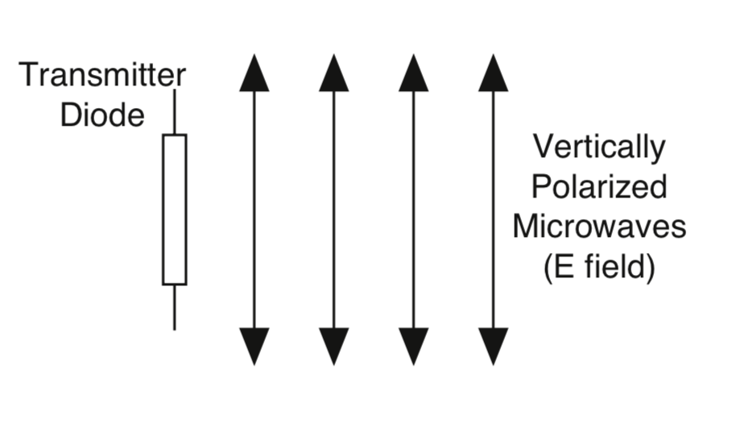

# Introduction
The purpose of this laboratory activity is to investigate various applications of microwave optics such as the phenomenon of polarization and how a polarizer can be used to alter the polarization of a microwave radiation, and the double-slit interference which provides an insight on the intensity of waves beyond the aperture depending on the angle of detection.\
Polarization is a transverse wave that has a specific geometrical orientation when it comes to the oscillations. Comparing to the different types of oscillations, such as linear, circular, and elliptical polarization. The microwave radiation coming from the transmitter in this experiment is linearly polarized along the transmitter diode axis. Since the transmitter is vertically aligned then the waves would be vertically polarized. 

   
  Figure 1: The microwave radiation from the transmitter is linearly polarized along the transmitter diode. As the radiation propagates through space, the electric field remains aligned with the axis of the diode.

If the transmitter diode would be at an angle $\theta$ then it would detect the component of the incident electric field that was aligned along its axis.

   
  Figure 2: The effect of the electric field depending on the angle $\theta$ as a component towards the vertically polarized microwave.

If the receiver meter reading $M$ is proportional to the electric field component $E$ along its axis, the meter would read the relationship:

$M=M_o\cos\theta$

 from Figure 2, $M_o$ is the initial receiver meter when the angle $\theta$ is at zero; meaning, when detector is inline with the vertically polarized microwave.\
The intensity of a linearly polarized electromagnetic wave is directly proportional to the square of the electric field $I=kE^2$. The receiver's meter reading is directly proportional to the incident microwave's intensity, then the meter would read a relationship of:

$M=M_o\cos^2\theta$

Theoretically, following Malus' law.\
The double-slit interference determines the intensity of the wave beyond the aperture depending on the angle $\theta$ of detection. The wave diffracts into two waves which superpose in the space beyond the apertures. Similar to the standing wave pattern, there are points in space where maxima are formed and others where minima are formed. For two thin slits separated by a distance $d$, maxima will be found at angles such that: 

$d\sin\theta=n\lambda$

Where $\theta$ is the angle of detection, $\lambda$ is the wavelength of the incident radiation, and $n \in \mathbb{Z}$. Moreover, minima will be found at angles such that: 

$d\sin\theta=\frac{n\lambda}{2}$
    

   
  Figure 3: The transmitter is placed at an angle $\theta$ and the waves are travelling through the slits separated with $d$ distance.

